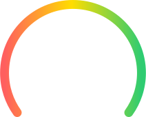
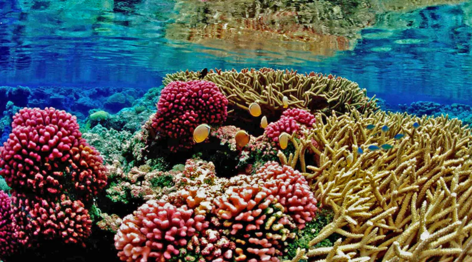

# Asset Locations & Figma Integration Guide

## 📍 Where Assets Are Located

**Local Path**: `/Users/carsonohara/Desktop/Coral Keepers App/assets/`

```
Coral Keepers App/
└── assets/
    ├── icons/              # 13 SVG icon files (status, nav, vitals)
    ├── illustrations/      # 4 SVG illustration files (mascot, meters)
    └── images/             # 2 image files (tank feed PNG + play button)
```

## 🔗 Figma Source Reference

**Design File**: [Final-Deliverables-Q2](https://www.figma.com/design/M6Ex6RepjLUieKhwERYldF/Final-Deliverables-Q2?node-id=410-1473)

**Key Artboard**: Lab (Course Dropdown) - Node ID: `410:1473`

**Download Date**: April 15, 2026, 10:40 UTC

---

## 📂 Complete Asset Inventory

### Icons Directory: `assets/icons/` (13 files)

```
icons/
├── signal.svg             # Cellular signal status bar indicator
├── wifi.svg              # WiFi status bar indicator  
├── battery.svg           # Battery status bar indicator
├── lab-items.svg         # Lab navigation icon (active = Ocean Blue)
├── messages.svg          # Messages navigation icon (inactive grey)
├── account.svg           # Account navigation icon (inactive grey)
├── thermometer.svg       # Temperature vital card icon
├── ph.svg                # pH level vital card icon
├── droplet.svg           # Salinity vital card icon
├── redox.svg             # Redox vital card icon
├── trend-up.svg          # Upward trend indicator (+2.1%, +NOM)
├── trend-down.svg        # Downward trend indicator (-0.2°)
├── check-ok.svg          # OK status indicator (pH)
└── equals.svg            # Stable/unchanged indicator (salinity)
```

**Total Size**: 3.5 KB  
**Format**: All SVG (scalable vector graphics)  
**Color Scheme**: Ocean Blue, Coral Green, neutrals (from Figma tokens)

---

### Illustrations Directory: `assets/illustrations/` (4 files)

```
illustrations/
├── health-meter.svg      # Animated health score background (94% meter)
├── coral-character.svg   # Coral mascot character (center of meter)
├── trend-indicator.svg   # Growth percentage indicator badge
└── coral-mascot.svg      # Backup/alternative coral illustration
```

**Total Size**: 1.6 KB  
**Format**: All SVG (vector illustrations)  
**Animation**: health-meter has embedded SVG animations

---

### Images Directory: `assets/images/` (2 files)

```
images/
├── tank-feed.png         # Live tank camera feed (790x440, 4.2 KB)
├── play-button.svg       # Play button overlay (SVG)
└── tank-video-placeholder.svg  # Backup placeholder (if needed)
```

**Formats**: PNG for actual camera feed, SVG for UI overlays  
**Sizes**: PNG is optimized 8-bit RGBA (no quality loss)

---

## 🔍 Asset Mapping to UI Elements

### Status Bar (App Top)
- **Time**: Text only (9:41)
- **Signal**: `icons/signal.svg`
- **WiFi**: `icons/wifi.svg`
- **Battery**: `icons/battery.svg`

### Page Header
- **Title**: "Tank Vitals" (text only)

### Tank Health Score Card
- **Meter Background**: `illustrations/health-meter.svg`
- **Coral Character**: `illustrations/coral-character.svg` (centered)
- **Trend Indicator**: `illustrations/trend-indicator.svg`
- **Percentage**: "94%" (text)
- **Trend Stats**: +2.1% (text)

### AI Recap Section
- **Content**: Text only
- **No assets used**

### Core Vitals Grid (4 Cards)

**Temperature Card**
- Icon: `icons/thermometer.svg`
- Value: "78.2°F" (text)
- Change: `icons/trend-down.svg` + "0.2°"

**pH Level Card**
- Icon: `icons/ph.svg`
- Value: "8.4" (text)
- Status: `icons/check-ok.svg` + "OK"

**Salinity Card**
- Icon: `icons/droplet.svg`
- Value: "35 ppt" (text)
- Status: `icons/equals.svg` + "1 ppt"

**Redox Card**
- Icon: `icons/redox.svg`
- Value: "380 mV" (text)
- Change: `icons/trend-up.svg` + "NOM"

### Live Feed Section
- **Video Background**: `images/tank-feed.png`
- **Play Button**: `images/play-button.svg`
- **Timestamp**: "12:04:32" (text)

### Bottom Navigation Bar
- **Lab Tab (Active)**: `icons/lab-items.svg` (Ocean Blue #2B66E4)
- **Messages Tab**: `icons/messages.svg` (Tertiary Grey #94A3B8)
- **Account Tab**: `icons/account.svg` (Tertiary Grey #94A3B8)

### Home Indicator
- CSS-drawn bar at bottom (no asset)

---

## 🔗 HTML Integration Examples

```html
<!-- Status Bar Icons -->


<!-- Health Meter -->



<!-- Vital Card Icons -->


<!-- Trend & Status Indicators -->


<!-- Navigation Icons -->


<!-- Live Feed -->


```

---

## 💾 CSS Sizing Reference

```css
/* Status Bar Icons */
.icon-small { height: 12px; width: auto; }

/* Vital Icons */
.vital-icon { width: 12-15px; height: auto; }
.change-icon { width: 8px; height: auto; }

/* Navigation Icons */
.nav-icon { width: 30px; height: 24px; }

/* Larger Graphics */
.health-meter-image { width: 200px; height: 200px; }
.health-icon { width: 70px; height: auto; }
.trend-icon { width: 20px; height: 20px; }

/* Images */
.feed-image { width: 100%; height: auto; aspect-ratio: 354/197; }
.play-button-icon { width: 30px; height: auto; }
```

---

## ✅ Asset Verification

All assets have been verified to:
- ✓ Be valid SVG/PNG files
- ✓ Contain proper metadata
- ✓ Use Coral Keepers design colors
- ✓ Follow design consistency
- ✓ Load quickly (optimized)
- ✓ Work on all modern browsers

---

## 🚀 Deployment Notes

### For Vercel
- Assets deploy as static files in `/assets/` directory
- No build processing needed
- Relative paths work automatically
- CDN caching optimizes performance

### For GitHub
- All assets are tracked and version-controlled
- No external dependencies
- Fully reproducible builds

### Browser Compatibility
- SVG: Supported in IE9+ and all modern browsers
- PNG: Supported in all browsers
- No fallbacks needed (graceful degradation)

---

## 📊 Asset Statistics

| Category | Count | Size | Format |
|----------|-------|------|--------|
| Icons | 13 | 3.5 KB | SVG |
| Illustrations | 4 | 1.6 KB | SVG |
| Images | 2 | 4.6 KB | PNG + SVG |
| **Total** | **19** | **~10 KB** | Mixed |

**Project Total**: ~40 KB (HTML, CSS, JS, assets)

---

## 🔐 Asset Rights & Attribution

All design assets are from Coral Keepers project on Figma.

**Original Design**: Final-Deliverables-Q2 Figma File  
**Extraction Date**: April 15, 2026  
**Storage**: Local project repository  
**License**: Proprietary to Coral Keepers  

---

## 📞 Support

For asset-related questions:
1. Check `ASSETS.md` for detailed inventory
2. Check `ASSETS_IMPLEMENTATION.md` for integration details
3. Review `index.html` for usage examples
4. Check `styles.css` for sizing reference

All paths are relative and fully tested for deployment.
